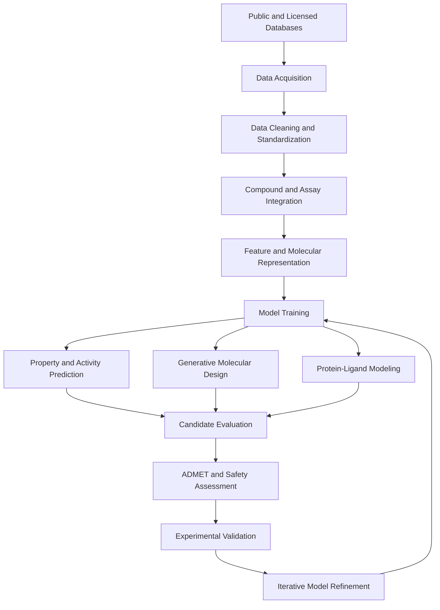

# Pharmaceutical Databases for AI-Driven Drug Discovery

A curated collection of pharmaceutical, chemical, biological, and structural databases for developing machine learning (ML), deep learning (DL), and generative AI models for drug discovery.

## 1. Database Catalog

### 1.1 Chemical Compounds and Bioactivity

| Database | Primary Data | Applications | URL |
|---|---|---|---|
| PubChem | Chemical structures, properties, bioassays | Molecular generation, property prediction | https://pubchem.ncbi.nlm.nih.gov/ |
| ChEMBL | Bioactive molecules, assay measurements, targets | QSAR, activity prediction, molecular optimization | https://www.ebi.ac.uk/chembl/ |
| BindingDB | Protein–ligand binding affinities | Binding prediction, hit prioritization | https://www.bindingdb.org/ |
| DrugBank | Drugs, targets, pharmacological annotations | Drug repurposing, drug–target prediction | https://go.drugbank.com/ |
| ZINC | Purchasable and virtual screening compounds | Virtual screening, molecular docking | https://zinc.docking.org/ |

### 1.2 Protein Structures and Biological Targets

| Database | Primary Data | Applications | URL |
|---|---|---|---|
| RCSB PDB | Experimental macromolecular structures | Structure-based drug design | https://www.rcsb.org/ |
| AlphaFold DB | Predicted protein structures | Protein structure modeling | https://alphafold.ebi.ac.uk/ |
| UniProt | Protein sequences and functional annotations | Target characterization | https://www.uniprot.org/ |
| Open Targets | Target–disease associations | Target identification and prioritization | https://platform.opentargets.org/ |
| Binding MOAD | Protein–ligand complexes and binding data | Structure–affinity analysis | https://bindingmoad.org/ |

### 1.3 Drug Properties, Toxicity, and Clinical Evidence

| Database | Primary Data | Applications | URL |
|---|---|---|---|
| Therapeutics Data Commons (TDC) | ML-ready drug discovery datasets and benchmarks | Model development and evaluation | https://tdcommons.ai/ |
| openFDA | Drug labels, regulatory data, adverse-event reports | Safety signal analysis | https://open.fda.gov/ |
| ClinicalTrials.gov | Registered clinical studies and results | Clinical evidence analysis | https://clinicaltrials.gov/ |
| PubMed | Biomedical literature | Evidence extraction and knowledge discovery | https://pubmed.ncbi.nlm.nih.gov/ |

*Note: Availability, bulk-download access, and permitted use vary by resource. Check individual terms before redistribution or commercial model training.*

---

## 2. AI Drug Discovery Workflow

## 3. Recommended Data Processing Stack

| Component | Recommended Tool | Function |
|---|---|---|
| Chemical standardization | RDKit | Structure cleaning, descriptors, fingerprints |
| Data integration | Python, pandas | Data processing and merging |
| Molecular representations | RDKit, DeepChem | Molecular features and model inputs |
| ML benchmarks | Therapeutics Data Commons | Dataset access and evaluation |
| Model development | PyTorch, scikit-learn | Training and inference |
| Structure-based modeling | PDB resources and molecular docking tools | Protein–ligand analysis |

Resources:
- RDKit: https://www.rdkit.org/
- DeepChem: https://deepchem.io/
- PyTorch: https://pytorch.org/
- scikit-learn: https://scikit-learn.org/

## 4. Suggested Data Integration Strategy

1. **Collect:** Retrieve compound structures and experimental measurements from PubChem, ChEMBL, and BindingDB.
2. **Standardize:** Normalize chemical structures, resolve identifiers, and remove duplicate records.
3. **Annotate:** Link compounds to biological targets, protein structures, and disease associations.
4. **Curate:** Preserve assay type, units, provenance, and experimental conditions.
5. **Partition:** Create training, validation, and test sets using scaffold-aware or temporal splits where appropriate.
6. **Train:** Develop predictive or generative models for defined research objectives.
7. **Evaluate:** Assess predictive performance, chemical validity, novelty, applicability domain, and relevant safety properties.
8. **Validate:** Experimentally assess promising candidates before drawing conclusions about biological activity or therapeutic potential.

## 5. Important Considerations

- **Data quality:** Experimental measurements from different assays may not be directly comparable.
- **Data leakage:** Closely related compounds across dataset splits can inflate evaluation metrics.
- **Licensing:** Public availability does not necessarily authorize unrestricted redistribution or commercial use.
- **Model limitations:** Predicted properties do not establish efficacy, safety, or clinical suitability.
- **Reproducibility:** Record dataset versions, retrieval dates, preprocessing procedures, model configurations, and evaluation protocols.

## 6. Scope

This catalog supports computational research in molecular generation, structure–activity relationship modeling, target prioritization, drug repurposing, and drug-property prediction. Generated candidates require independent scientific assessment and appropriate experimental validation.

